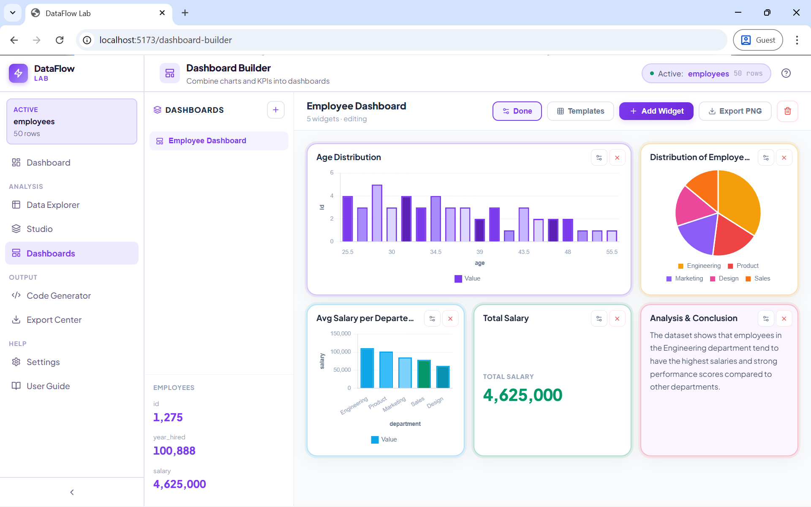
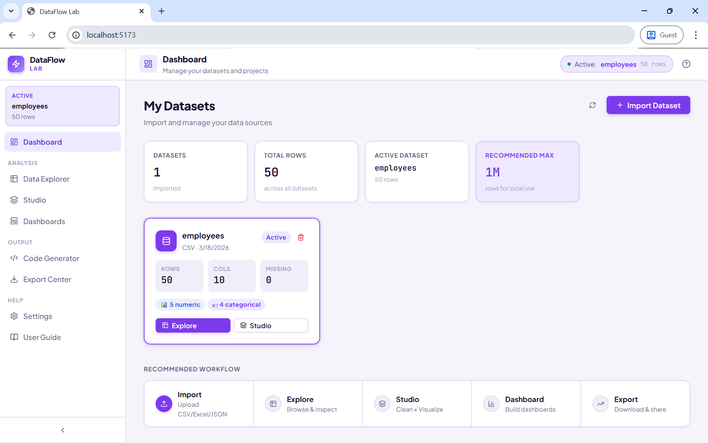
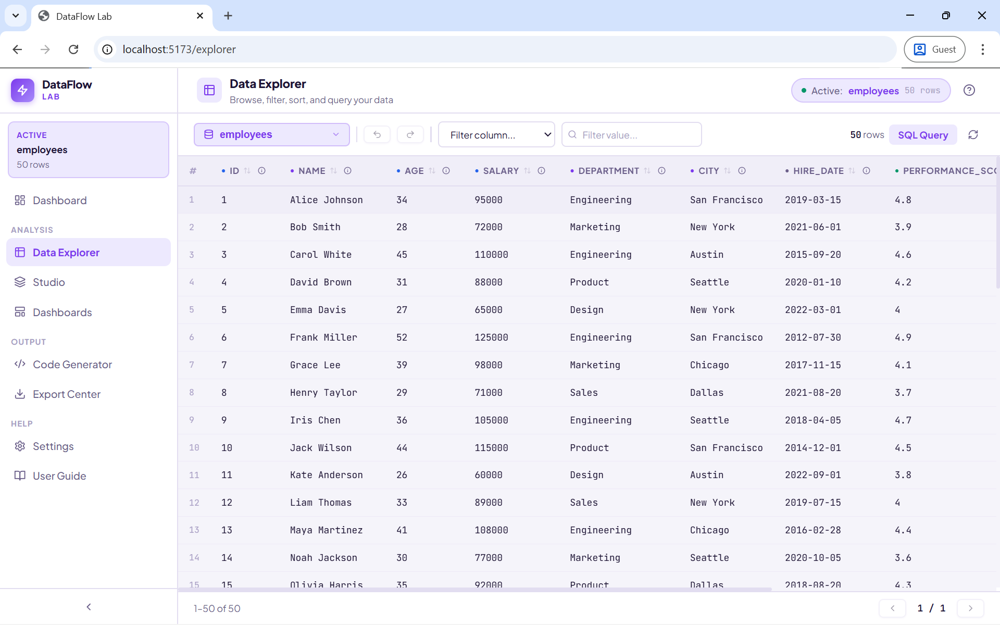
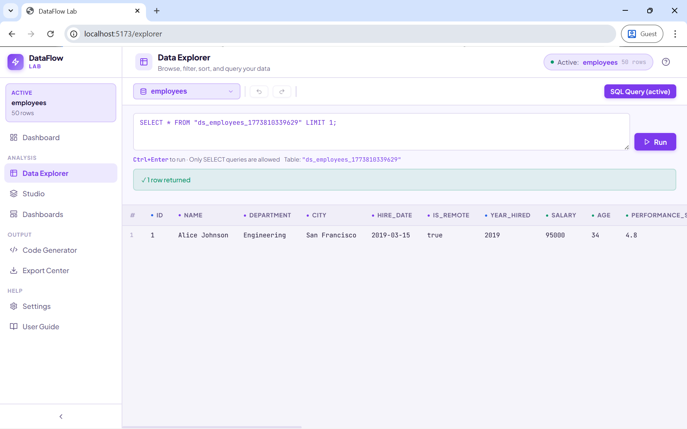
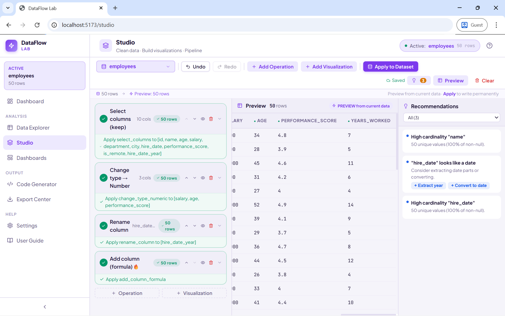
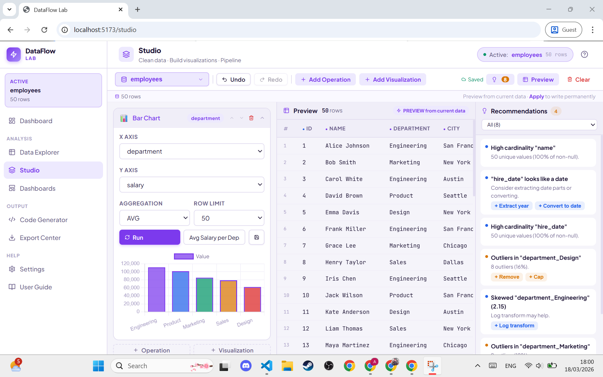
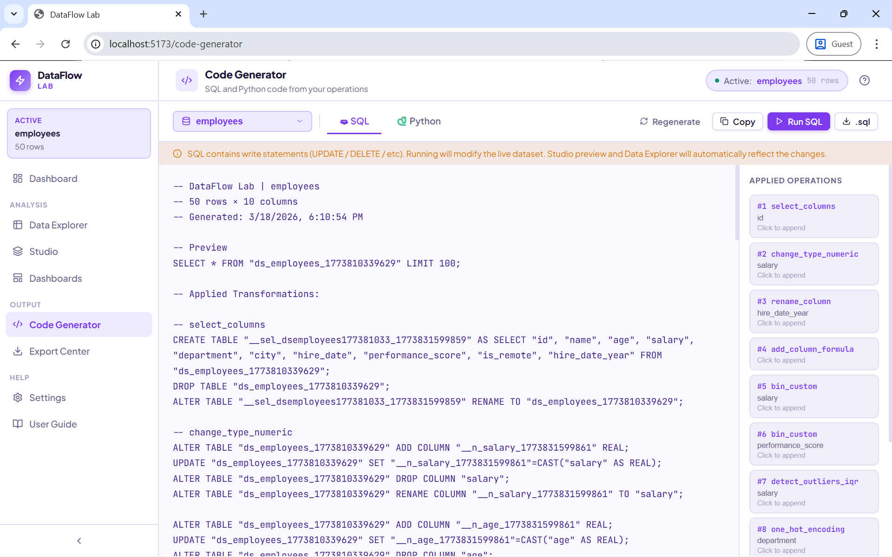
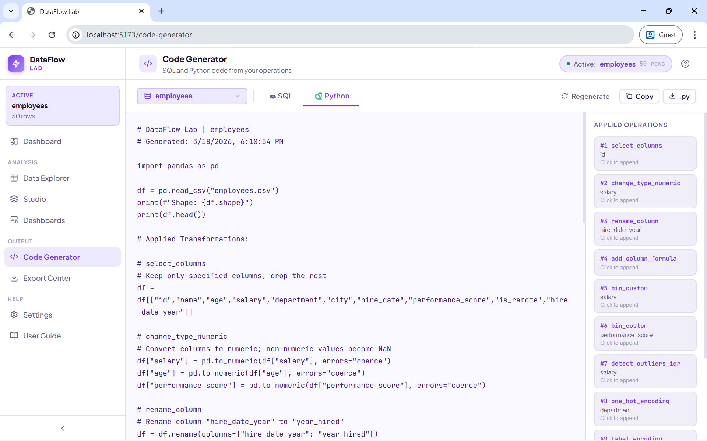
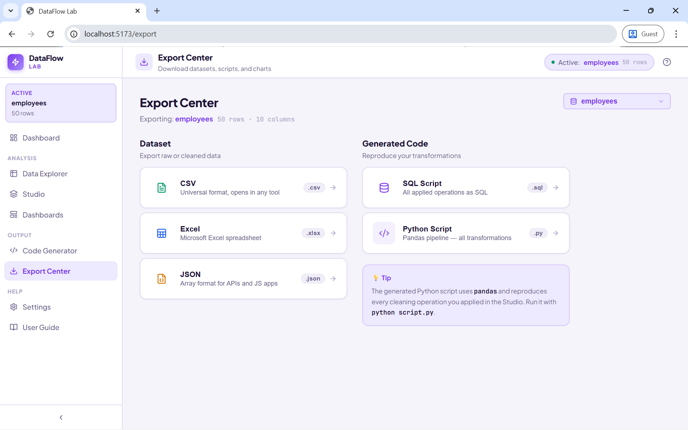
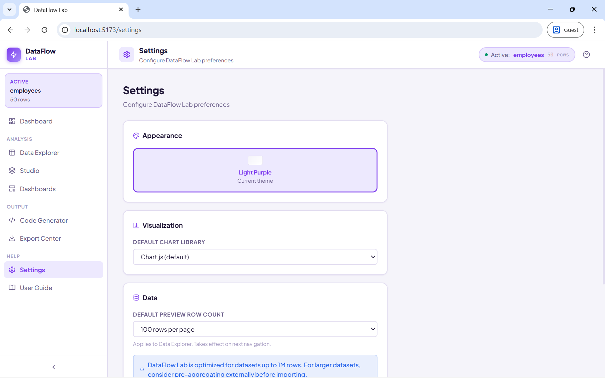

<div align="center">

# ⚡ DataFlow Lab

**A local-first data analytics workbench for cleaning, exploring, visualizing, and dashboarding your data — no cloud required.**

[](https://nodejs.org)
[](https://react.dev)
[](https://sqlite.org)
[](https://vitejs.dev)
[](LICENSE)
[](CONTRIBUTING.md)

[✨ Features](#-features) · [🖼️ Screenshots](#️-screenshots) · [🚀 Getting Started](#-getting-started) · [🏗️ Tech Stack](#️-tech-stack) · [🤝 Contributing](#-contributing)



</div>

---

## 🌟 Overview

DataFlow Lab is a full-stack data analytics application that runs entirely on your local machine. Import CSV, Excel, or JSON files and immediately explore, clean, visualize, and publish dashboards — all without sending a single byte to an external server.

The application pairs a **Node.js + Express + SQLite** backend with a **React + Vite + Chart.js** frontend. Every transformation you apply is translated into both **SQL** and **Python (pandas)**, giving you reproducible, portable pipelines you can run independently.

> 🔒 **Privacy first.** All data is stored locally in SQLite. Nothing leaves your machine. No sign-up. No telemetry.

---

## ✨ Features

### 🗂️ Data Explorer
- Sortable, filterable, paginated table view for any imported dataset
- Per-column statistics: null count, unique count, min/max/mean, top values, outlier count
- Inline **SQL Query mode** — run custom `SELECT` statements directly against your data
- Undo/redo on all sort and filter actions

### 🔬 Studio — Clean · Visualize · Pipeline
- **50+ cleaning operations** organized by category: column ops, missing data, text cleaning, numeric transforms, encoding, outlier detection, binning, date extraction, and more
- Pipeline canvas: add, reorder, toggle, and preview each step before committing
- Live preview after each operation — see row counts, schema changes, and affected values
- 🤖 **AI-powered recommendations**: DataFlow Lab profiles your data automatically and surfaces actionable suggestions (fill nulls, trim whitespace, fix mixed case, log-transform skewed columns, detect outliers, etc.)
- 15+ **chart types** in the visualization builder: bar, line, area, pie, donut, scatter, histogram, time series, stacked bar, and more

### 📊 Dashboard Builder
- Drag-and-drop multi-widget canvas in a responsive **3-column grid**
- **📈 Chart widgets** — embed any saved visualization with proper axis labels and bottom-center legend
- **🔢 KPI widgets** — fully data-driven with two modes:
  - **🟢 Basic mode**: dropdown Aggregation (COUNT/SUM/AVG/MIN/MAX) + Column + optional Filter → SQL auto-generated
  - **🔴 SQL mode**: write any `SELECT` returning a single value; optional Trend % query
  - Live **Preview** button to test before saving
- **📝 Text / Notes widgets** — free-form annotations and insights
- 5 layout sizes: Small, Medium, Large, Wide, Full (with proper `gridRow: span` for tall widgets)
- **Export PNG** at 2× hi-res via html2canvas
- 4 built-in dashboard templates

### 💻 Code Generator
- Every Studio operation generates executable **SQL** and **Python (pandas)** code automatically
- Edit code freely in the browser and **Run SQL** live against your dataset
- ⚠️ **Mutation detection**: warns before `UPDATE`/`DELETE`/`ALTER` — syncs changes back to Explorer and Studio automatically
- Download as `.sql` or `.py` script

### 📤 Export Center
- Dataset: **CSV**, **Excel (.xlsx)**, **JSON**
- Code: **SQL script**, **Python (pandas) pipeline**

### ⚙️ Settings
- Default preview row count (persisted via `localStorage`, read by Explorer on every mount)
- Default chart library preference

---

## 🖼️ Screenshots

### 1️⃣ Dashboard — Home
The home screen shows all imported datasets with key stats (rows, columns, missing values, numeric/categorical breakdown). A **Recommended Workflow** strip at the bottom guides new users through the full Import → Explore → Studio → Dashboard → Export journey.



---

### 2️⃣ Data Explorer
Browse your dataset in a sortable, filterable table. Click any column header for statistics, or switch to SQL Query mode.



---

### 3️⃣ SQL Query Mode
Write any `SELECT` query directly in the explorer. Results appear inline with row counts.



---

### 4️⃣ Studio — Cleaning Pipeline
Build a step-by-step cleaning pipeline. Each card shows the operation, affected columns, and row count after applying. The right panel surfaces AI-driven recommendations from automatic data profiling.



---

### 5️⃣ Studio — Visualization Builder
Add charts alongside cleaning steps. Configure X/Y axes, aggregation, and row limit, then click **Run** to render the chart. Save it to use in a dashboard.



---

### 6️⃣ Dashboard Builder
Combine charts, live KPI widgets, and text annotations on a multi-column canvas. Resize widgets and export the entire dashboard as a PNG.


---

### 7️⃣ Code Generator — SQL
Every cleaning operation compiles to SQL. Edit and run the script live; write operations automatically sync back to the Explorer and Studio preview.



---

### 8️⃣ Code Generator — Python
Switch to the Python tab to get the equivalent pandas pipeline. Copy or download the `.py` script to reproduce your entire transformation outside DataFlow Lab.



---

### 9️⃣ Export Center
Download the dataset in CSV, Excel, or JSON, or export the generated SQL/Python scripts.



---

### 🔟 Settings
Configure default row count for Explorer pagination and chart library preferences. Settings persist across sessions via `localStorage`.



---

## 🚀 Getting Started

### 📋 Prerequisites

| Requirement | Version |
|---|---|
| Node.js | 18 or higher |
| npm | 8 or higher |

### 📦 Installation

```bash
# 1. Clone the repository
git clone https://github.com/adin-alxndr/dataflow-lab.git
cd dataflow-lab

# 2. Install all dependencies (root + server + client) in one command
npm run setup
```

> The `setup` script installs dependencies for the root, backend, and frontend automatically — no need to `cd` into each folder manually.

### ▶️ Running

**Option A — one command (recommended)**

```bash
npm start
```

This uses [`concurrently`](https://github.com/open-cli-tools/concurrently) to launch both the backend API (port 3001) and the frontend dev server (port 5173) in a single terminal.

**Option B — two terminals (if you prefer)**

```bash
# Terminal 1 — backend API
cd server && npm run dev

# Terminal 2 — frontend
cd client && npm run dev
```

Open **http://localhost:5173** in your browser.

### 🗄️ Importing your first dataset

1. Click **Dashboard** in the left sidebar
2. Click **Import Dataset**
3. Upload a **CSV**, **Excel (.xlsx/.xls)**, or **JSON** file — or paste a public URL
4. DataFlow Lab auto-detects column types (`integer`, `real`, `text`, `date`) and computes statistics

> 💡 **Supported sizes:** up to ~1M rows. For larger datasets, pre-aggregate with DuckDB or Polars first.

### 🏗️ Build for Production

```bash
cd client
npm run build
# Output in client/dist/ — serve via Express backend or any static host
```

---

## 🏗️ Tech Stack

### 🖥️ Backend
| Package | Purpose |
|---|---|
| Express | HTTP server & REST API |
| better-sqlite3 | Embedded SQLite (sync API, no server) |
| multer | File upload handling |
| xlsx | Excel file parsing and export |
| uuid | Dataset and operation ID generation |

### 🎨 Frontend
| Package | Purpose |
|---|---|
| React 18 | UI framework |
| Vite 5 | Dev server and build tool |
| Chart.js + react-chartjs-2 | All chart rendering |
| Zustand | Global state management |
| react-hot-toast | Toast notifications |
| Lucide React | Icon library |

---

## 🧮 Cleaning Operations Reference

| Category | Operations |
|---|---|
| 📋 **Column** | Select columns, rename, rename multiple, duplicate, merge, split, add formula, change type, drop |
| 🗃️ **Rows** | Filter, remove by condition, sort, limit, sample, remove duplicates |
| 🩹 **Missing Data** | Remove nulls, fill mean/median/mode/value/forward/backward, fill by group |
| 🏷️ **Encoding** | Label encoding, one-hot encoding, binary (mode flag) encoding |
| ✏️ **Text** | Lowercase, uppercase, capitalize, trim, replace, remove special chars, remove numbers, string length |
| 🔢 **Numeric** | Normalize (0–1), normalize to range, z-score standardize, log transform, clip, absolute value, round, floor, ceil, rank, percentile |
| 📉 **Outliers** | Remove by IQR, cap (Winsorize) by IQR, detect/flag by IQR |
| 🪣 **Binning** | Equal-width bins, custom bin edges with optional string labels |
| ➕ **Aggregation** | Group by + aggregate (COUNT/SUM/AVG/MIN/MAX) |
| 🚩 **Conditions** | Create binary flag column, conditional replace |
| 📅 **Date** | Extract year/month/day/weekday/hour/quarter, convert to date, date difference |

---

## 🤝 Contributing

Contributions are very welcome! DataFlow Lab is a side project with plenty of room to grow. Here's how to get involved:

### 🐛 Reporting Bugs

1. Check the [existing issues](https://github.com/adin-alxndr/dataflow-lab/issues) to avoid duplicates
2. Open a new issue with the **Bug report** template
3. Include:
   - Steps to reproduce
   - Expected vs actual behavior
   - Browser and OS version
   - A small sample dataset if relevant

### 💡 Suggesting Features

1. Open a [Feature Request](https://github.com/adin-alxndr/dataflow-lab/issues/new?template=feature_request.md) issue
2. Describe the use case — *why* do you need this?
3. Include examples, mockups, or references if you have them

### 🔧 Submitting a Pull Request

```bash
# 1. Fork the repo and clone your fork
git clone https://github.com/adin-alxndr/dataflow-lab.git
cd dataflow-lab

# 2. Create a feature or fix branch
git checkout -b feat/your-feature-name
# or
git checkout -b fix/bug-description

# 3. Install dependencies and start dev servers (see Getting Started)

# 4. Make your changes, then commit with a descriptive message
git commit -m "feat: add Parquet export to Export Center"

# 5. Push and open a Pull Request against main
git push origin feat/your-feature-name
```

### 📐 Commit Message Convention

This project follows [Conventional Commits](https://www.conventionalcommits.org/):

| Prefix | When to use |
|---|---|
| `feat:` | ✨ A new feature |
| `fix:` | 🐛 A bug fix |
| `docs:` | 📝 Documentation only |
| `refactor:` | ♻️ Code change that isn't a fix or feature |
| `perf:` | ⚡ Performance improvement |
| `test:` | 🧪 Adding or updating tests |
| `chore:` | 🔧 Build process, dependencies, tooling |

### 🗺️ Good First Issues

Looking for somewhere to start? Check issues tagged [`good first issue`](https://github.com/adin-alxndr/dataflow-lab/labels/good%20first%20issue). Some ideas:

- 🌍 Add more date format detection patterns to `inferType`
- 🎨 Add a dark mode theme toggle
- 📊 Add a new chart type (heatmap, waterfall, bullet chart)
- 🧪 Write unit tests for the SQL/Python code generators
- 🌐 Add i18n / localization support
- 📱 Improve mobile layout responsiveness
- 📦 Add Parquet export via DuckDB-wasm

### 📏 Code Style Guidelines

- **JavaScript/JSX** — match the existing file style (no TypeScript, no enforced linting, but keep it readable and consistent)
- **Backend routes** — follow the pattern in `cleaning.js`: validate params → generate SQL → return `{ success, ... }`
- **Frontend components** — inline styles using CSS variables; no Tailwind, no CSS modules
- **Statistical formulas** — if adding a new numeric operation, verify the formula mathematically, add a comment with the derivation, and make sure the SQL handles `NULL` and empty-string values correctly

### 🙏 Thank You

Every contribution — whether a bug report, a typo fix, or a new feature — makes DataFlow Lab better for everyone. Thank you for taking the time! 🎉

---

## 📜 License

[MIT](LICENSE) — free to use, modify, and distribute.

---

<div align="center">

Built with ❤️ · Running entirely on your machine · No cloud, no sign-up, no tracking

⭐ If DataFlow Lab is useful to you, consider starring the repo!

</div>
